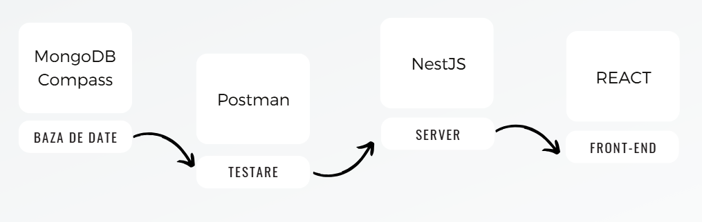

# Ski App 🏔️🎿

Ski App is an application designed to provide up-to-date information about ski slopes in Romania and weather conditions, helping users plan their snow days easily and efficiently. The application also includes an interactive forum where users can share their experiences, give advice, and connect with others.

## Features

* **Real-time slope and weather updates:** Stay informed about conditions to make the most of your ski trips.
* **Interactive forum:** Share tips, experiences, and feedback with the community.
* **Scalable backend:** Built with NestJS for a modular and maintainable architecture.
* **Dynamic and user-friendly frontend:** Developed with React for responsive and interactive user experiences.

## Getting Started

Follow these steps to set up and run the project locally:

### Backend
1. Navigate to the backend folder:
   ```bash
   cd backend
   ```
2. Install dependencies:
    ```bash
   npm install
    ```
3. Start the server:
   ```bash
   npm run start
    ```

### Frontend
1. Navigate to the client folder:
    ```bash
   cd client
    ```
2. Install dependencies:
    ```bash
   npm install
    ```
3. Start the application:
    ```bash
   npm run dev
    ```

## Technologies Used

* **NestJS:** A progressive Node.js framework for building efficient and scalable server-side applications.
* **React:** A popular library for building modern, dynamic, and responsive user interfaces.
* **Mantine:** A React component library offering a rich set of UI components for rapid development.
* **Postman:** A tool for testing
* **MongoDB:** A NoSQL database for efficient and scalable data storage.
* **OpenWeatherMap API:** An API for providing real-time weather data
* **Jest:** A JavaScript testing framework designed for writing and running unit and integration tests
* **Playwright:**  A library for end-to-end testing 
* **K6:** A modern performance testing tool used to simulate high loads and measure the system's reliability and scalability under stress.



## Documentation

* [Mantine - UI Component Library](https://mantine.dev/)
* [NestJS - Backend Framework](https://nestjs.com/)
* [Postman - API Testing Tool](https://www.postman.com/)
* [MongoDB - NoSQL Database](https://www.mongodb.com/)
* [OpenWeatherMap API - Weather Data](https://openweathermap.org/api)
* [Jest](https://jestjs.io/)
* [Playwright](https://playwright.dev/)
* [K6](https://k6.io/)

